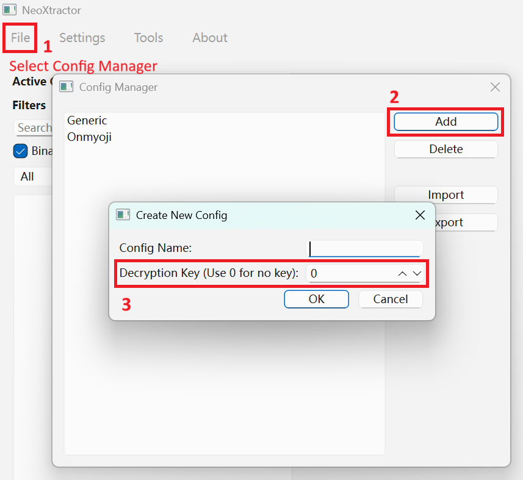

# NeoXtractor


[](https://discord.gg/eedXVqzmfn)

A Python tool for extracting, viewing, and converting files from NPK archives used by Netease's NeoX game engine.

THIS TOOL IS IN ITS EARLY STAGES, ANY HELP IS WELCOME! FEEL FREE TO OPEN A PULL REQUEST OR FORK THE REPOSITORY IF YOU WISH TO ADD SOMETHING OR FIX ANY ISSUE YOU SPOT

## Download

Download the latest release at [GitHub Releases](https://github.com/MarcosVLl2/NeoXtractor/releases)

## Usage

### GUI

1. Run `neoxtractor.exe` directly to start in GUI mode.
2. Some games' NPK (EXPK) requires XOR key to be set. We have default profile for Onmyoji currently. To set XOR key, create a new config in Config Manager.

3. Open the NPK file.

#### Introduction


Main window is divided into two main parts: File list area and preview area.

In the file list area, you are able to:
- Select current config

  Note that every time you change the config, the current loaded NPK file will be unloaded.

- Filter entries inside NPK file
- View NPK's file list

Within the file list area, you can right click to operate on the selected entries. Currently, you can:
- Extract all selected entries
- Open selected entries with specific viewer
- Rename current entry

  You must select only one entry to rename the entry.

  New name of the entry is bind to entry's file signature. All names are saved in current active config.

### CLI

Command-line interface is still being worked on.

## Development

You will need [uv](https://github.com/astral-sh/uv) to properly setup the development environment.

1. Install dependencies
```bash
uv sync
```

2. Create virtual environment
```bash
uv venv
```

3. Enter virtual environment (required every time you start to work on the project)
```bash
# Linux
source .venv/bin/activate

# Windows
.venv/bin/activate.bat
```

## Have questions?

Feel free to join the Discord server (link at the top of this document) to ask them!

## Acknowledgements

**NeoX is an in-house game engine developed by Netease.**

**NeoXtractor is not affiliated with Netease.**

This tool is limited for educational purposes.